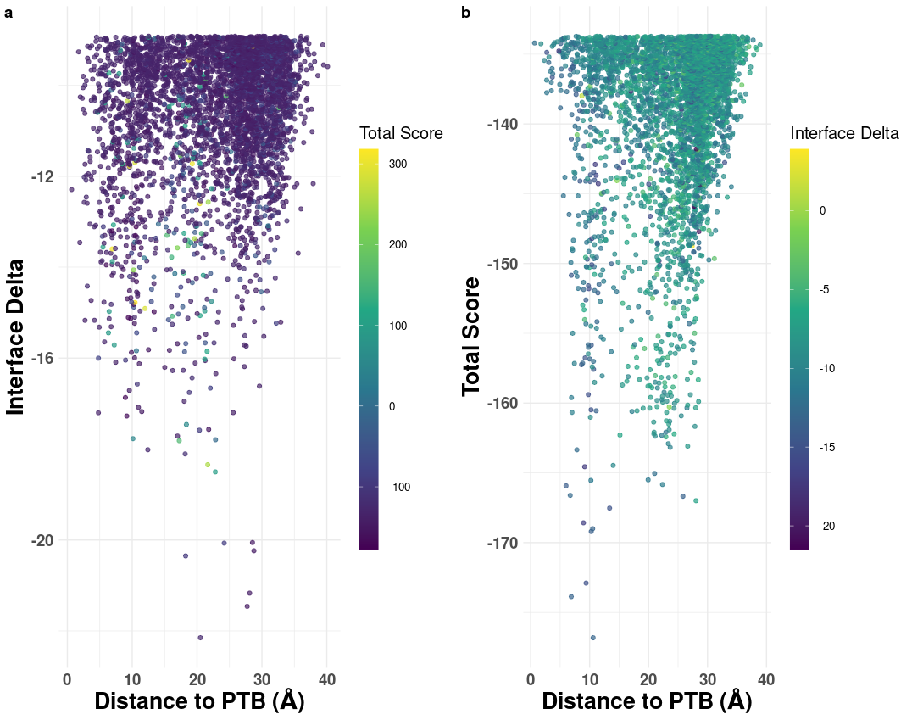
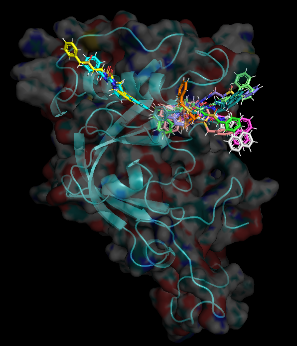
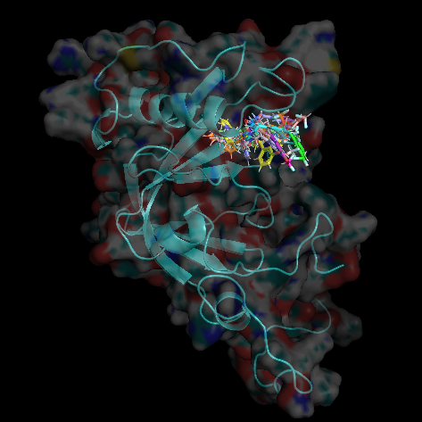
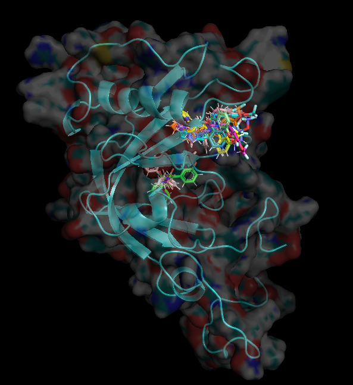
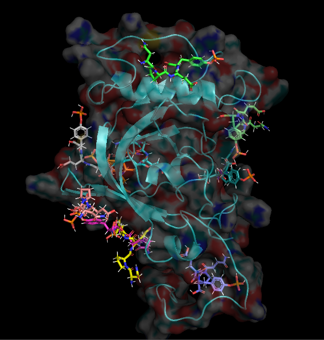
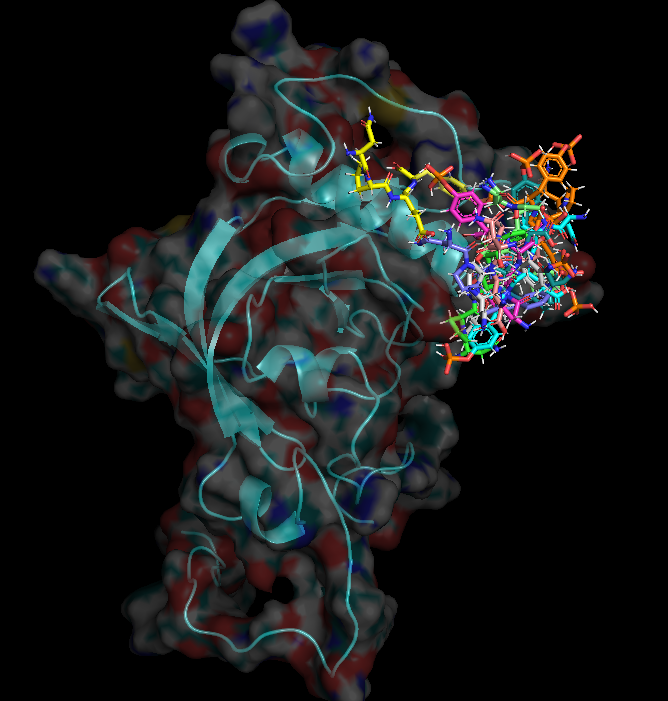
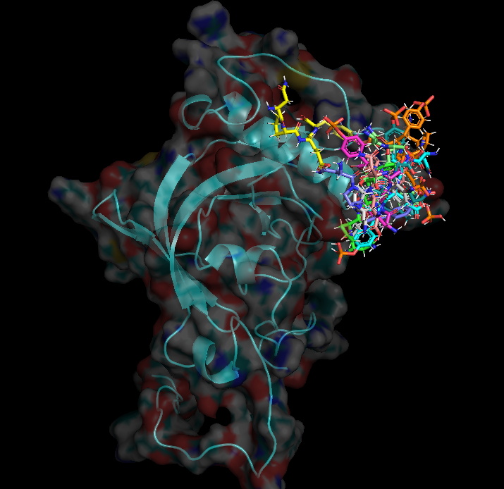
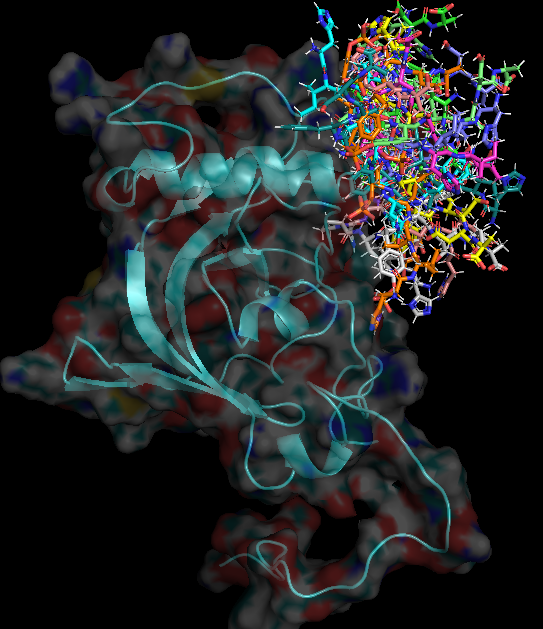
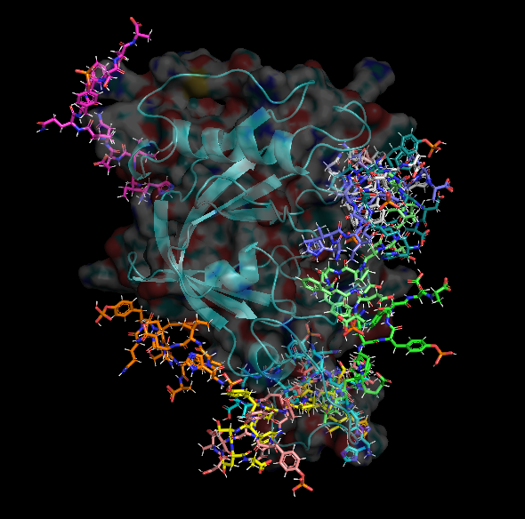
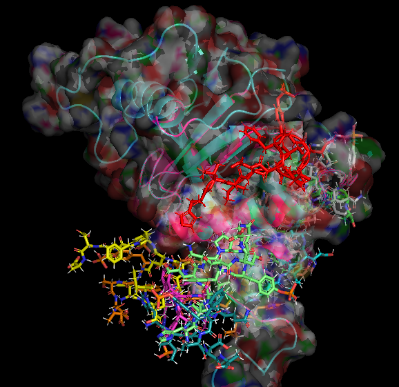

# Software

This section briefly describes the primary software used for conducting and preparing ligand docking simulations.

## Rossetta

The Rosetta suite was used to preform the actual ligand docking simulations. Rosetta was downloaded and compiled to a remote cluster where all simulations were ran.

I often accessed the following resources when determining how to run Rosetta for ligand docking.

1. [Rosetta ligand docking demo](https://www.rosettacommons.org/demos/latest/tutorials/ligand_docking/ligand_docking_tutorial)
2. [Rosetta Ligand docking with flexible XML protocols](https://pubmed.ncbi.nlm.nih.gov/22183535/)
3. [Rosetta Documentation](https://www.rosettacommons.org/docs/latest/Home)


## BioChemicalLibrary (BCL)

[BCL](http://www.meilerlab.org/bclcommons) was used for generating libraries of conformers (different possible conformations of a ligand) from one specific structure. These conformer libraries would then be given to Rosetta in order to simulate ligand flexibility. 

## Open Bable

The [Open Babel](http://openbabel.org/wiki/Main_Page) suite was used for one-off file conversions in cases where `sdf` files needed to be converted to `pdb` or similar operations were required.

## PyMol

[PyMol](https://pymol.org/2/) was used to to visualize the results of ligand docking experiments, create images and present results.

## SLURM

All significant compute (namely docking experiments) where ran using the workload manager SLURM. Some programs will not work (RDBC) if other workload managers are used.

## RDBC

[Rosetta ligand docking batch job submission control and organizer](https://github.com/EthanHolleman/RDBC) is a Python command line program I created to help me submit large number of Rosetta docking simulations to the remote cluster's workload manager, SLURM. 

# General workflow

This section describes the general procedure for running docking simulations to access the binding of a specific ligand to a specific protein target.

## Prepare protein structure

First, a ligand free protein structure was repacked using the `ligand_rpkmin.static.linuxgccrelease` program of the Rosetta suite. Repacking was repeated for 100 structures and the lowest energy structure is selected as the docking target. 

## Prepare ligand

A file that describes the ligand geometry and properties needs to be generated. Rosetta requires this “params” file for docking any small molecule not already present in the Rosetta database, which in practice are most small molecule. For `RTX ...` drugs this was just a matter of using the `sdf` files as the starting material. If the simulation involved docking a ligand / peptide from an existing co-crystal structure Pymol was used to create a `pdb` file containing only the ligand / peptide. Open Bable was then used to convert the `pdb` file to `sdf` format. 

Next, the ligand conformer library and Rosetta `params` files was generated for the to-be-docked ligand. This simulates ligand flexibility during docking. This was usually completed with [this Python script](https://gist.github.com/EthanHolleman/4c306ce7985fb2887c4fecef0f723988) which wraps the BCL `molecule:ConformerGenerator` program and the Rosetta `molfile_to_params.py` located in `main/source/scripts/python/public/` of a standard Rosetta installation. 

## Prepare RDBC files

I almost always used [RDBC](https://github.com/EthanHolleman/RDBC) to actually run the docking simulations on the remote cluster. RDBC works by using templates of files that would be required for individual jobs and filling them out based on the command line arguments to run many jobs. One of the most important is the Rosetta XML docking protocol which determines exactly what Rosetta does during the simulations. For random docking experiments (where the ligand is positioned at a random position around the protein before docking) I used the [random_docker_template.xml](https://github.com/EthanHolleman/RDBC/blob/main/handler/xml_templates/random_docker.xml). 

## Submit jobs with an RDBC command

Once all nessecary files are created the Rosetta docking simulations where submitted to SLURM using RDBC. Below is an example command I used to for randomly docking the NPEYp peptide to the 1OY2 shc structure.

```
python3 ~/software/RDBC/rh.py -l ~/jobs/dock_random_NPEYp/ligand \
-p ~/jobs/dock_random_NPEYp/protein/Shc1-PTB_1OY2_0061.pdb \
-o ~/jobs/dock_random_NPEYp/results \
-e ~/software/rosetta_bin_linux_2020.08.61146_bundle/\
main/source/bin/rosetta_scripts.static.linuxgccrelease \
-i 2000 \
-op ~/software/RDBC/handler/xml_templates/random_docker.xml \
-b ~/jobs/dock_random_NPEYp/templates/NPEYp.sbatch \
-mi 10
```

- -l: Location of my ligand preparation files produced during the *prepare ligand* step. This included
    - NPEYp_conformers.pdb: Conformer structures generated with BCL.
    - NPEYp.params: Rosetta params file generated by molfile_to_params.py
    - NPEYp.pdb: PDB structure of the NPEYp ligand converted from a provided sdf file.
- -p: Path to target protein. Selected during the *prepare protein structure* step.
- -o: Output path. Where I want the results of simulations to be written to.
- -e: Path to Rosetta scripts exe.
- -i: Number of individual simulations each job should run. This is equivalent to the number of poses Rosetta will produce.
- -op: Path to Rosetta XML protocol file. In this case I used one designed for random docking.
- -b: Path to template `batch` file. This is filled out for each individual job in order to submit many smaller jobs instead of one larger one. This avoids issues if the reasrouces you can use for one job are limited (as was my case).
- -mi: Tells RDBC to submit 10 copies of this job, which allows for simulating more poses when resources for individual jobs are constrained. 

Then we just wait for our jobs to complete.

## Aggregate run copies

For random docking that submits multiple copies of the same job, I found it easier to aggregate the results into one large file that is easier to work with for plotting in programs like R. 

If RDBC was used to submit such a job, it can also be used for aggregating the results using the `-mai` argument. If my jobs created by the example command had just finished they could be aggregated into one large results tab separated file called `NPEYp.agg.tsv` with the command below.

```
RDBC/rh.py -o /home/ethollem/jobs/dock_random_NPEYp/results -mia NPEYp.agg.tsv
```


Each row in this file represented one completed docking simulation. Simulations can be uniquely identified by comparing both the `description` and the `iter_id columns`.

## Add additional data to aggregate score file

In addition to the metrics produced by Rosetta during the docking simulations we are also interested in having some additional data points listed below.

1. Average ligand position: An easy to calculate metric that describes the general location of the ligand in space. Will include three columns, one for each coordinate (x, y, z).
2. Path to pdb file: This is to make viewing the pose easier later on. This will be a column that contains the path to the pdb file representing the final results of the docking simulation. It should be noted that this path will be specific to one machine.
3. Distance to PTB domain. Using the average ligand position we can calculate an approximate euclidean distance to the PTB domain. This value is unsigned. 

These data points can be added to aggregated score files using the [extend_agg_file.r](https://gist.github.com/EthanHolleman/fadebd0273c923a243c3315203a2f711) R script, namely the `extend_agg_file` function contained therein. This function will produce a `RDS` file that can then be opened using the R function `readRDS`.


## Optionally create "energy well" plots

While not strictly required for the analysis you can use the [energy_well.r](https://gist.github.com/EthanHolleman/a7aaaf41926cb5f13ab32c62b79d9fc0) R script in order to create plots that compare distance to the PTB domain (or whatever location is specified when running [extend_agg_file.r](https://gist.github.com/EthanHolleman/fadebd0273c923a243c3315203a2f711)) to total score and interface delta X of all, or a subset of the simulations. An example plot selecting for the top 15% of results is shown below.



## Identify best poses

With all the results of the docking simulations aggregated into one file, they can be reviewed using any program capable of reading large deliminated text files (I will be using R for the rest of this document).

Two primary metrics where used to access to docking quality of a specific pose.

1. `total_score`: A measure of the overall stability of the protein-ligand complex. Lower values indicate increased stability.
2. `interface_delta_X`: The difference in protein structure stability with and without the ligand in complex. Lower values indicate the ligand has a greater stabilizing effect on the protein structure upon binding and therefore potentially higher affinity.

In order to balance out the two metrics I also assessed poses using a combined metric which considered both interface delta X and total score. This is because I saw a non-zero number of cases where one metric would be very low and the other very high or vice versa.


Where

- $s_{t}$ = total score
- $i_{\Delta}$ = interface delta X

This normalizes both total score and interface delta x between -1 and 1 and then adds them together. Poses with both low interface delta X and total score will be ranked higher.

I haven't really seen a combined metric like this used very often, or at least not explicitly in the papers I looked through so I mainly used it as an indicator to access which primary metric might make more sense to use.

# Results


## Included data

This document is primary housed at a GitHub repository which you can access [at this link](https://github.com/EthanHolleman/shc_docking). The repo also contains many data files that are discussed in part below. Within the `data` directory you will find a directory for each ligand discussed below. The structure of each ligand directory will look something like:

```
.
├── best_poses_pdbs
│   ├── combined_metric
│   ├── interface_delta_x
│   └── total_score
├── best_poses_pymol
│   ├── interface_delta_x
│   └── total_score
└── best_poses_tables
```

- best_poses_pdbs: Contains `pdb` files of the best scoring poses, accessed by multiple metrics.
- best_poses_pymol: Contains PyMol session files of the `pdb` files stored in `best_poses_pdbs`.
- best_poses_tables: `csv` files that were used to generate the tables in this section.

## Docking RTX60933293

RTX60933293 was docked into a repacked version of `1OY2` (`Shc1-PTB_1OY2_0061.pdb`) using a library of 100 possible conformers and randomized starting positions. 27847 different poses were scored.

### Best poses by total score

| Filename                                | Total Score |
|-----------------------------------------|-------------|
| Shc1-PTB_1OY2_0061_RTX60933293_3913.pdb | -176.816    |
| Shc1-PTB_1OY2_0061_RTX60933293_2879.pdb | -173.871    |
| Shc1-PTB_1OY2_0061_RTX60933293_0313.pdb | -172.901    |
| Shc1-PTB_1OY2_0061_RTX60933293_3287.pdb | -169.206    |
| Shc1-PTB_1OY2_0061_RTX60933293_3917.pdb | -169.001    |
| Shc1-PTB_1OY2_0061_RTX60933293_2406.pdb | -168.58     |
| Shc1-PTB_1OY2_0061_RTX60933293_3818.pdb | -167.529    |
| Shc1-PTB_1OY2_0061_RTX60933293_1493.pdb | -166.992    |
| Shc1-PTB_1OY2_0061_RTX60933293_0693.pdb | -166.676    |
| Shc1-PTB_1OY2_0061_RTX60933293_1167.pdb | -166.612    |

[Link to Pymol Session](https://github.com/EthanHolleman/shc_docking/blob/main/data/RTX60933293/best_poses_pymol/total_score/top_10_ts.pse)

Eight of the top ten ligands localize in a "hole" near residue 76 when ranked by total score.


### Best poses by interface delta X

| Filename                                | Interface Delta X |
|-----------------------------------------|-------------------|
| Shc1-PTB_1OY2_0061_RTX60933293_0388.pdb | -22.15            |
| Shc1-PTB_1OY2_0061_RTX60933293_3583.pdb | -21.459           |
| Shc1-PTB_1OY2_0061_RTX60933293_1898.pdb | -21.169           |
| Shc1-PTB_1OY2_0061_RTX60933293_2943.pdb | -20.351           |
| Shc1-PTB_1OY2_0061_RTX60933293_2844.pdb | -20.236           |
| Shc1-PTB_1OY2_0061_RTX60933293_0260.pdb | -20.069           |
| Shc1-PTB_1OY2_0061_RTX60933293_1709.pdb | -20.056           |
| Shc1-PTB_1OY2_0061_RTX60933293_0925.pdb | -18.502           |
| Shc1-PTB_1OY2_0061_RTX60933293_1029.pdb | -18.345           |
| Shc1-PTB_1OY2_0061_RTX60933293_0839.pdb | -18.107           |

[Link to Pymol Session](https://github.com/EthanHolleman/shc_docking/blob/main/data/RTX60933293/best_poses_pymol/interface_delta_x/best_poses_idx.pse)

When ranking poses by interface delta X, ligands cluster to a pocket on the other side of the protein, in closer proximity to the beta sheet.


However, when using the combined metric, all of these poses disappear from the top 10, indicating while the interface delta X was low, the total score was high.



## RTX73145433

RTX73145433 was docked into a repacked version of `1OY2` (`Shc1-PTB_1OY2_0061.pdb`) using a library of 100 possible conformers and randomized starting positions. 39561 different poses were scored. 

### Best poses by total score

| Filepath                                | Total Score |
|-----------------------------------------|-------------|
| Shc1-PTB_1OY2_0061_RTX73145433_2004.pdb | -181.271    |
| Shc1-PTB_1OY2_0061_RTX73145433_1670.pdb | -175.014    |
| Shc1-PTB_1OY2_0061_RTX73145433_2468.pdb | -174.888    |
| Shc1-PTB_1OY2_0061_RTX73145433_3451.pdb | -174.707    |
| Shc1-PTB_1OY2_0061_RTX73145433_0529.pdb | -174.689    |
| Shc1-PTB_1OY2_0061_RTX73145433_1889.pdb | -173.494    |
| Shc1-PTB_1OY2_0061_RTX73145433_1610.pdb | -172.676    |
| Shc1-PTB_1OY2_0061_RTX73145433_0417.pdb | -172.376    |
| Shc1-PTB_1OY2_0061_RTX73145433_1412.pdb | -171.933    |
| Shc1-PTB_1OY2_0061_RTX73145433_3579.pdb | -171.669    |

The csv version of this table is available [from this link](https://github.com/EthanHolleman/docking_results/blob/main/data/RTX73145433/best_poses_tables/RTXRTX73145433_best_ts.csv)

[Link to Pymol session](https://github.com/EthanHolleman/docking_results/blob/main/data/RTX73145433/best_poses_pymol/total_score/top_10.pse)

In general, when accessing ligands by total score, there is extremely strong preference for a "hole" hear residue 76.



### Best poses by interface delta x

| Filename                                | Interface Delta X |
|-----------------------------------------|-------------------|
| Shc1-PTB_1OY2_0061_RTX73145433_2082.pdb | -24.12            |
| Shc1-PTB_1OY2_0061_RTX73145433_2480.pdb | -23.709           |
| Shc1-PTB_1OY2_0061_RTX73145433_2282.pdb | -23.628           |
| Shc1-PTB_1OY2_0061_RTX73145433_2123.pdb | -23.275           |
| Shc1-PTB_1OY2_0061_RTX73145433_3408.pdb | -23.015           |
| Shc1-PTB_1OY2_0061_RTX73145433_0811.pdb | -22.881           |
| Shc1-PTB_1OY2_0061_RTX73145433_1380.pdb | -22.648           |
| Shc1-PTB_1OY2_0061_RTX73145433_2358.pdb | -22.411           |
| Shc1-PTB_1OY2_0061_RTX73145433_2155.pdb | -22.266           |
| Shc1-PTB_1OY2_0061_RTX73145433_0099.pdb | -22.186           |

The csv version of this table is available [from this link](https://github.com/EthanHolleman/docking_results/blob/main/data/RTX73145433/best_poses_tables/RTXRTX73145433_best_idx.csv)

[Link to Pymol session](https://github.com/EthanHolleman/docking_results/blob/main/data/RTX73145433/best_poses_pymol/interface_delta_x/top_10.pse)

When accessing the best poses by lowest interface delta X ligands tend to cluster on the opposite side of Shc (comapred to clustering as measured by total score)


However, some of these poses have very high total scores including some with positive values, while none of the best ligands as ranked by total score had a positive interface delta X.

When accessing using the combined metric, ligands generally look like those scored using only total score. This is shown in the figure below.



## NPEYp Docking

The NPEYp region of the insulin receptor was docked into the 1OY2 receptor using a random starting position and a library of 100 most likely NPEYp conformers generated using BCL. A total of 17695 simulations where completed. The purpose of these simulations was to try and determine possible locations for NPEYp binding and use these locations to access if the Shc inhibiting drugs may be acting competitively or allosterically.    

### Best poses by total score

| Filename                          | Total Score |
|-----------------------------------|-------------|
| Shc1-PTB_1OY2_0061_NPEYp_0537.pdb | -167.35     |
| Shc1-PTB_1OY2_0061_NPEYp_1446.pdb | -167.051    |
| Shc1-PTB_1OY2_0061_NPEYp_0157.pdb | -164.652    |
| Shc1-PTB_1OY2_0061_NPEYp_0269.pdb | -164.631    |
| Shc1-PTB_1OY2_0061_NPEYp_1213.pdb | -164.392    |
| Shc1-PTB_1OY2_0061_NPEYp_0630.pdb | -164.072    |
| Shc1-PTB_1OY2_0061_NPEYp_0753.pdb | -163.858    |
| Shc1-PTB_1OY2_0061_NPEYp_0321.pdb | -163.757    |
| Shc1-PTB_1OY2_0061_NPEYp_0004.pdb | -163.145    |
| Shc1-PTB_1OY2_0061_NPEYp_0834.pdb | -162.682    |

[Link to PyMol session](https://github.com/EthanHolleman/shc_docking/blob/main/data/NPEYp/best_poses_pymol/total_score/top_10.pse)





When measuring only by total score, NPEYp top 10 poses where some of the least selective. Molecules can be seen all around the protein. The interface delta for the poses was reasonable considering ranking was done by total score (`-4.281 -6.266 -7.734 -3.400 -6.974 -5.512 -7.841 -4.556 -5.864 -2.591`). This could suggest that the binding location of NPEYp is very sensitive to the exact conformation of the peptide.

### Best poses by interface delta x

| Filename                          | Interface Delta X |
|-----------------------------------|-------------------|
| Shc1-PTB_1OY2_0061_NPEYp_1460.pdb | -11.326           |
| Shc1-PTB_1OY2_0061_NPEYp_0303.pdb | -10.987           |
| Shc1-PTB_1OY2_0061_NPEYp_1588.pdb | -10.977           |
| Shc1-PTB_1OY2_0061_NPEYp_1750.pdb | -10.953           |
| Shc1-PTB_1OY2_0061_NPEYp_1372.pdb | -10.686           |
| Shc1-PTB_1OY2_0061_NPEYp_1037.pdb | -10.4             |
| Shc1-PTB_1OY2_0061_NPEYp_0480.pdb | -10.336           |
| Shc1-PTB_1OY2_0061_NPEYp_1109.pdb | -10.22            |
| Shc1-PTB_1OY2_0061_NPEYp_0964.pdb | -10.196           |
| Shc1-PTB_1OY2_0061_NPEYp_0613.pdb | -10.188           |




In contrast to the results of NPEYp docking when ranking by total score, ranking by interface delta X showed basically opposite results with peptides tightly clustering around the "hole" both RTX drugs had shown preference for at least one metric. This could be indicating that the most stabilizing complexes of Shc-NPEYp occur at this interface.

### Best poses by combined metric

[Link to PyMol Session](https://github.com/EthanHolleman/shc_docking/blob/main/data/NPEYp/best_poses_pymol/interface_delta_x/top_10.pse)



Results when using the combined metric were much more similar to docking poses when ranking by interface delta X. This implies that overall stability of these structures were similar to best structures when ranked only by total score but with better interface delta X values.

## Trka to 1OY2 docking

The Trka peptide was docked into the same 1OY2 Shc structure used in the simulations above. A total of 12477 simulations where ran and evaluated.

### Best poses by total score

| Filename                         | Total Score |
|----------------------------------|-------------|
| Shc1-PTB_1OY2_0061_trka_0007.pdb | -167.695    |
| Shc1-PTB_1OY2_0061_trka_0288.pdb | -166.184    |
| Shc1-PTB_1OY2_0061_trka_0124.pdb | -163.624    |
| Shc1-PTB_1OY2_0061_trka_0200.pdb | -163.604    |
| Shc1-PTB_1OY2_0061_trka_0105.pdb | -163.25     |
| Shc1-PTB_1OY2_0061_trka_0183.pdb | -163.127    |
| Shc1-PTB_1OY2_0061_trka_0003.pdb | -162.872    |
| Shc1-PTB_1OY2_0061_trka_0172.pdb | -162.239    |
| Shc1-PTB_1OY2_0061_trka_0236.pdb | -161.053    |
| Shc1-PTB_1OY2_0061_trka_0094.pdb | -160.684    |



[Link to PyMol Session](https://github.com/EthanHolleman/shc_docking/blob/main/data/Trka_1OY2/best_poses_pymol/total_score/top_10.pse)

Docking by total score showed high degree of clustering to the same binding pocket NPEYp favored when evaluated by total score (and partly interface delta X).

### Best poses by interface delta X

| Filename                         | Interface Delta X |
|----------------------------------|-------------------|
| Shc1-PTB_1OY2_0061_trka_0051.pdb | -15.562           |
| Shc1-PTB_1OY2_0061_trka_0066.pdb | -13.215           |
| Shc1-PTB_1OY2_0061_trka_0281.pdb | -13.002           |
| Shc1-PTB_1OY2_0061_trka_0303.pdb | -12.916           |
| Shc1-PTB_1OY2_0061_trka_0162.pdb | -12.846           |
| Shc1-PTB_1OY2_0061_trka_0095.pdb | -12.444           |
| Shc1-PTB_1OY2_0061_trka_0249.pdb | -12.301           |
| Shc1-PTB_1OY2_0061_trka_0004.pdb | -12.251           |
| Shc1-PTB_1OY2_0061_trka_0104.pdb | -12.218           |
| Shc1-PTB_1OY2_0061_trka_0087.pdb | -12.165           |



[Link to PyMol Session](https://github.com/EthanHolleman/shc_docking/blob/main/data/Trka_1OY2/best_poses_pymol/interface_delta_x/top_10.pse)

## Trka to 1Shc peptide docking

Lastly, the Trka peptide from *Zhou et al* co-crystal structure was removed from the structure and docked back. This was mainly a test to compare the results of docking Trka to 1OY2.

### Best poses by total score

| Filename                | Total Score |
|-------------------------|-------------|
| 1shc_0002_trka_0343.pdb | -126.279    |
| 1shc_0002_trka_0795.pdb | -123.926    |
| 1shc_0002_trka_0396.pdb | -123.409    |
| 1shc_0002_trka_0484.pdb | -118.201    |
| 1shc_0002_trka_0266.pdb | -117.033    |
| 1shc_0002_trka_1243.pdb | -115.823    |
| 1shc_0002_trka_1765.pdb | -115.614    |
| 1shc_0002_trka_0665.pdb | -115.468    |
| 1shc_0002_trka_0161.pdb | -114.785    |
| 1shc_0002_trka_0764.pdb | -114.668    |


Generally, when measuring by total score the Trka peptide docked in close proximity to the original location (shown in red but hard to see).

[Link to PyMol Session](https://github.com/EthanHolleman/shc_docking/blob/main/data/Trka_1shc/best_poses_pymol/total_score/top_10.pse)


### Best poses by interface delta X

| Filename                | Interface Delta X |
|-------------------------|-------------------|
| 1shc_0002_trka_0494.pdb | -14.107           |
| 1shc_0002_trka_1649.pdb | -14.042           |
| 1shc_0002_trka_1524.pdb | -13.857           |
| 1shc_0002_trka_0612.pdb | -13.479           |
| 1shc_0002_trka_0258.pdb | -13.388           |
| 1shc_0002_trka_0604.pdb | -12.973           |
| 1shc_0002_trka_0020.pdb | -12.886           |
| 1shc_0002_trka_0985.pdb | -12.842           |
| 1shc_0002_trka_0449.pdb | -12.837           |
| 1shc_0002_trka_1784.pdb | -12.752           |

However, this was not the case when measuring by interface delta X, with Rosetta prefering to place Trka on the backside of the protein compared to the co-crystal position.

[Link to Pymol Session](https://github.com/EthanHolleman/shc_docking/blob/main/data/Trka_1shc/best_poses_pymol/interface_delta_x/top_10.pse)



# Discussion

There is no molecular modeling or ligand docking program that can be used solely to draw biological conclusions in the absence of additional experimental data, so the best we can do here is attempt to make sense of a potentially noisy dataset of ligand poses. 

Overall, the RTX drugs both seemed to show preference for the "hole" near residue 71 of the 1OY2 shc structure when accessing by the combined metric. It cannot be ignored though that changing the metric you evaluate by can make this association less cut-and-dry. Differences in binding locations of ligands when accessing interface delta X or total score may be driven by poses that increase overall complex stability but force specific residues into more unfavorable conformations comparatively decreasing total score.

Given the localization of the NPEYp peptide to this same hole when docked to the 1OY2 structure and evaluated by interface delta X and the combined metric there is preliminary evidence to suggest that the RTX drugs may be acting competitively, increasing insulin sensitivity by sterically blocking access to this site. Additionaly, the RTX drugs localizing to this site do so with ~2x the affinity (as measured by interface delta X) which points towards the potential of these drugs to out-compete NPEYp for binding to Shc at this specific site. 

While writing this I realized it would be benefical to also dock the ligand with the least affinity for Shc. This would help access if the pocket near residue 71 is actually showing specificity for both NPEYp and the RTX ligands or if there is something about this pocket that allows Rosetta to find "something for everyone".


